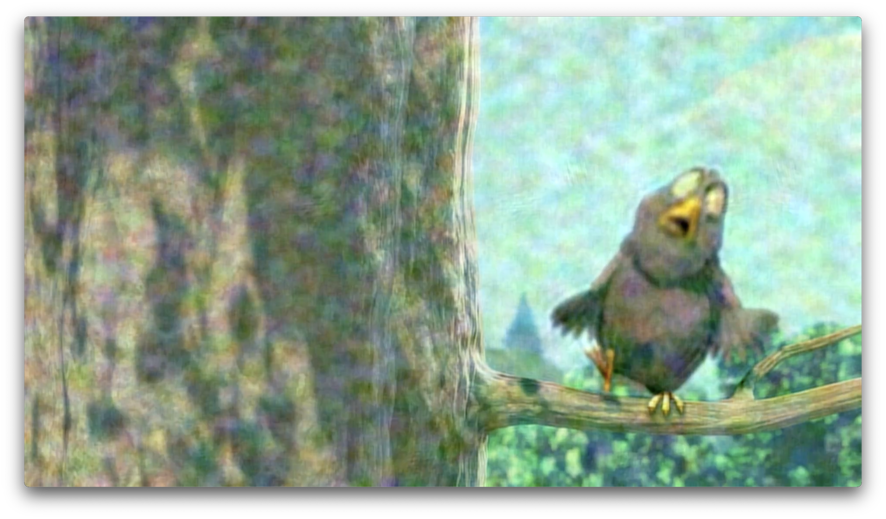

# softcast-rs

softcast-rs is an implementation of [Szymon Jakubczak\'s 2011 thesis](https://dspace.mit.edu/handle/1721.1/66006 "SoftCast : exposing a waveform interface to the wireless channel for scalable video broadcast") of a hybrid analog digital video transmission mechanism, SoftCast. SoftCast achieves a linear relationship between video quality and signal-to-noise-ratio by employing joint source channel coding of video and the wireless channel. SoftCast is more robust in challenging radio environments than digital video transmitted via traditional means, and requires less bandwidth at comparable quality than analog video systems (NTSC, PAL) by employing techniques from video codecs. 

softcast-rs can encode and transmit video, then receive and decode, using software defined radios. The goal of this project is to refine both software and protocol for real time transmission and reception, suitable for real world deployments.

The employed protocol is unstable and subject to change. The implementation omits self describing information to minimize metadata.

softcast tx-camera only runs on Raspbian.
softcast receive, transmit, and all other operations only run on macOS.

## Requirements
- fftw
- limesuite
- libcamera (Raspbian)

## Installation
After installing dependencies, use cargo to build.

## Usage
Transmit from a Raspberry Pi camera:
```
softcast tx-camera -n SAMPLE_RATE -f CARRIER_FREQ -b BANDWIDTH
```
Receive from macOS:
```
softcast rx -n SAMPLE_RATE -f CARRIER_FREQ -b BANDWIDTH --y Y_CHUNK_DIM --cbcr CBCR_CHUNK_DIM  path/to/outfile.mp4 RESOLUTION FRAME_RATE
```

Without a software defined radio, a digital simulation can be performed:
```
softcast simulate --noise 0.01 path/to/infile/mp4 path/to/outfile.mp4
```


*Example of a compressed SoftCast-encoded image frame recovered over a noisy channel*

## Contact
If you would like to collaborate on, deploy, or commercially license softcast-rs, please email me at jordan.schneider.media at gmail.com.

## License
This project is licensed under the [GNU GPLv3](LICENSE).